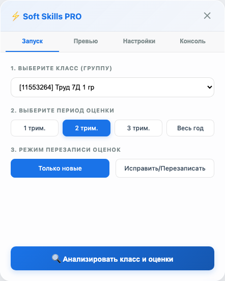
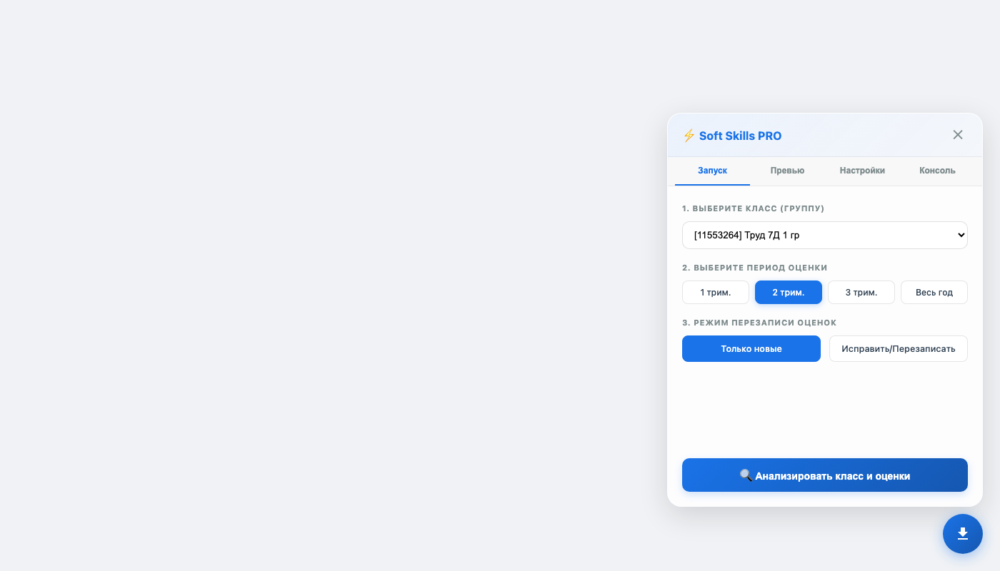

# МЭШ — Автозаполнение Soft Skills

Браузерное расширение (Tampermonkey) для автоматического заполнения оценки «soft skills» всем ученикам прямо в интерфейсе МЭШ.

> ⚡ **Больше не нужен Python, терминал и ручной ввод токена.**  
> Всё работает прямо в браузере: нажал кнопку → скрипт сам находит токен → заполняет.

---

## 🎥 Как это выглядит

 | 
:---:|:---:
Кнопка в правом нижнем углу | Окно с настройками запуска

---

## 📦 Установка

### 1. Установи Tampermonkey

Открой в браузере официальный магазин расширений и установи **Tampermonkey**:

- [Chrome / Edge](https://www.tampermonkey.net/) (Chrome Web Store)
- [Firefox](https://addons.mozilla.org/firefox/addon/tampermonkey/)
- [Safari](https://apps.apple.com/app/tampermonkey/id1482490089)

### 2. Установи скрипт

1. Скачай файл **[`mesh_soft_skills_autofill_pro.user.js`](./mesh_soft_skills_autofill_pro.user.js)** (нажми → «Save link as...» / «Сохранить как...»)
2. Перетащи скачанный файл в окно браузера — Tampermonkey сам предложит установить скрипт
3. Нажми **«Install»** (Установить)

### 3. Проверь

1. Зайди на **[school.mos.ru](https://school.mos.ru)** и войди в аккаунт
2. В правом нижнем углу появится **синяя круглая кнопка** ⬇️
3. Нажми на неё — откроется окно Soft Skills PRO



---

## 🚀 Как пользоваться

### Первый запуск

1. Нажми на синюю кнопку в правом нижнем углу
2. В открывшемся окне **выбери класс** (группу) из выпадающего списка
3. Выбери **триместр** (1, 2, 3 или весь год)
4. Выбери режим:
   - **Только новые** — пропускает учеников, которым уже выставлены оценки
   - **Исправить/Перезаписать** — удаляет старые оценки и проставляет новые
5. Нажми **«Анализировать класс и оценки»**

### Проверь результаты

После анализа открой вкладку **«Превью»** — увидишь таблицу со всеми учениками, их средним баллом и рассчитанными ответами:

| Имя | Ср.б. | Орг | Обр | Рег | Ком |
|-----|-------|-----|-----|-----|-----|
| Иванов | 4.50 | Всегда | Часто | Всегда | Часто |
| Петров | 3.20 | Редко | Редко | Часто | Редко |

> 🔧 **Можно вручную изменить** любой ответ через выпадающий список перед отправкой.

### Отправь в МЭШ

1. Убедись, что все ответы корректны
2. Нажми **«Отправить данные в МЭШ»**
3. Отслеживай прогресс во вкладке **«Консоль»**

---

## ⚙️ Настройки

Во вкладке **«Настройки»** можно:

- **Пороги оценок** — настроить, при каком среднем балле ставить «Всегда», «Часто», «Редко», «Никогда»
- **Токен и Profile-Id** — скрипт захватывает их автоматически, но можно вставить вручную

---

## ❓ Частые вопросы

**Ничего не появляется после установки?**
1. Открой консоль браузера: **F12 → Console**
2. Ты должен увидеть:
   ```
   [SoftSkills PRO] Скрипт загружен
   [SoftSkills PRO] Загружаю список групп учителя...
   ```
3. Если нет — проверь, включён ли Tampermonkey для school.mos.ru (иконка Tampermonkey → «Enabled»)
4. Если есть — значит кнопка просто не видна. Попробуй обновить страницу (F5)

**Скрипт не видит кнопку?**
Кнопка в правом нижнем углу, 56×56 пикселей, синяя. Если не видно:
- Уменьши масштаб страницы (Ctrl/Cmd −)
- Проверь, не перекрывает ли её что-то (например, чат-помощник МЭШ)

**Сколько занимает отправка?**
~0.5–1 секунда на ученика. Класс из 30 человек — около 20 секунд.

**Можно отменить?**
Просто закрой вкладку. Уже отправленные ответы останутся.

**Ошибка «Сессия истекла»?**
Нажми «Сохранить всё» во вкладке «Настройки» — скрипт перезахватит токен. Или просто обнови страницу.

**Старая Python-версия?**
[`mesh_soft_skills_autofill.py`](./mesh_soft_skills_autofill.py) — консольная версия для терминала. Работает, но менее удобна. Рекомендую пользоваться браузерной версией.

---

## 🧠 Как это работает

1. Скрипт перехватывает Bearer-токен и Profile-Id из сетевых запросов МЭШ
2. Загружает расписание учителя и определяет список классов
3. Для каждого класса загружает оценки учеников за выбранный триместр
4. Вычисляет средний балл для каждого ученика
5. На основе среднего балла рассчитывает ответы на вопросы soft skills:
   - Варьирует ответы между разными вопросами (например, «Выступления» — ниже, «Домашние задания» — выше)
   - Добавляет случайную дельту, чтобы ответы не были одинаковыми у всех
6. Отправляет ответы в МЭШ через API
